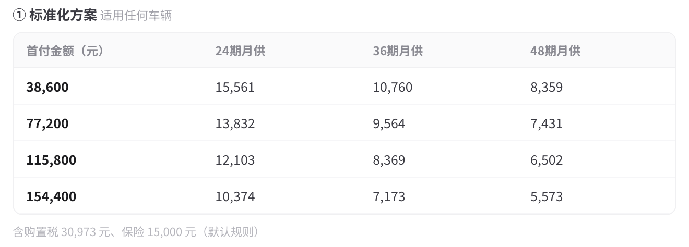

# 03.3车辆专家

> 归属：02.1 PC 端交互文档 · 数字人专家分组「物流」  
> 本节定义：专家卡文案、推荐问题池、Skill 边界与唤起、车辆查询 / 对比 / 金融方案三大能力、表格渲染规范、金融报价引擎规则（整合《车辆管理平台-AI智能体金融报价》及三份配置表）。

---

## 1 专家卡文案

---

## 2 推荐问题

轮换与埋点规则同 8.2（配置中心存储、每次展示 3 条、顺序循环、曝光点击埋点带 question_id）。含【】占位符的条目走推荐话术卡占位符高亮逻辑。

---

## 3 Skill 定义与唤起边界

车辆专家是执行层的一个 Skill（vehicle_expert），挂三个工具：vehicle_search（车辆管理平台产品中心）、vehicle_compare、finance_quote（金融报价引擎）。

### 3.1 唤起方式

### 3.2 能力边界

---

## 4 场景分类与输出定义

### 4.1 场景分类

#### 4.1.1 总表

用户 query 先经两级判定：**意图**（查询 / 推荐 / 对比 / 金融方案 / 追问详情）×**命中数**（0 / 1 / 2-10 / >10），查询query一律输出带金融按钮输出

#### 4.1.2 输出表格字段详情

详细参考车辆那边团队给的标准化表格，如用户直接问则展示基础标准字段，如是问详细字段则展示 下一步问具体信息标识，如要全部字段，则展示全部字段。

[标准化.xls](../03-原始资料/03.3车辆专家/标准化.xls)

### 4.2 车辆 对比 场景

#### 4.2.1 会话全局序号与对比池

**路径1 明确字段**：帮我对比xx 和xx（有唯一值），直接出对比方案

**路径2 指代消解**：用户问「推荐一款 30 万以内的 LNG 牵引车」→ 出一款推荐→ 用户再问「再推荐一款别的品牌」→ 出一款产品→ 用户接着问「对比这两款」或直接打字"对比一下"→ **不弹澄清**，思考过程里会明说"对比池里两款聚焦车型，指代明确，直接出对比"  
**路径3 多车澄清**：询问30万以内的牵引车，出了列表 在列表中可以进行选中对比

**路径4 多车澄清**：用户先查一批车（列表A），再查一批车（列表B），然后说「对比第一个列表的第几个和第二个列表的第几个」。

新增：对比池，当对比需求勾选时出现，可供用户进行选择对比，不猜用户具体是想要什么对比，仅在点选单个车辆信息后进行展示。

#### 4.2.2 对比场景交互

指代解析失败（「对比那两个绿的」）→ 澄清意图。

#### 4.2.3 型号对比的歧义处理

##### 核心约束

##### 判定逻辑

#### 4.2.4 对比表输出规范

### 4.4 金融 方案 场景

[车辆管理平台-AI智能体金融报价](https://my.feishu.cn/wiki/QuSiwTLYLieJrQkwZHycUswdngh) 具体生成的报价规则 请参考这个文档

#### 4.4.1 唯一方案原则

约束：

#### 4.4.2 生成入口与多车逻辑

#### 4.4.3 金融方案生成格式

##### 1 标准化方案（适用于任何车辆）

**方案要素区（表格上方）**：车辆型号、车辆售价、购置税、预估保费。展示金额，**不展示任何比例与利率**。

**方案矩阵**：行 = 期数（24 / 36 / 48），列 = 首付档位 1\-6（表头展示计算后的首付金额，如「首付一 ¥58,600」，不展示档位比例），单元格 = 月还款 \+ 总成本两行。

**计算规则（报价引擎实现，前端不感知，此处为引擎侧需求）**：

##### 2 合营购车方案（仅限合营车型表内车辆）

**前置澄清**：合营方案首付与《合营购车车型和金融方案》表按客户等级（S级 / A级）区分。生成前走 4\.2 澄清卡：「该车支持合营购车，你的客户是哪个等级？」选项：S级客户 / A级客户 / 不确定；选「不确定」则两个等级方案并排展示。

**方案表**：（按照用户提供的表进行匹配，匹配上的则有，没有则不展示）

##### 3 免责与提示文案

#### 4.4.4 按金额测算金融方案

当用户只给金额时，按照标准化方案公式输出金融方案，按照表格输出即可。直接输出到对话里，不保存到产出物里。

## 5 状态与异常

## 6 兜底策略

