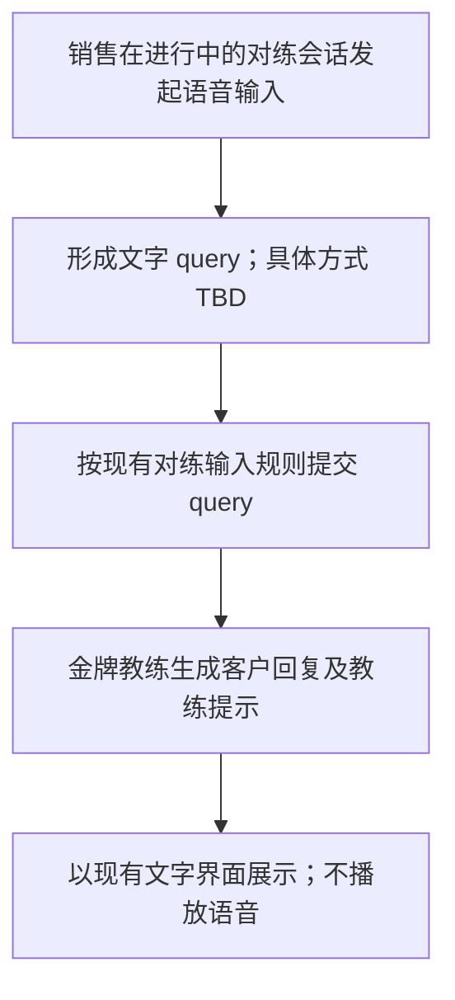

# 金牌教练｜语音输入需求（草稿）

> 范围：仅定义销售通过语音输入 query；金牌教练不提供语音输出。未确认的实现和交互细节以 TBD 标记。本文件独立于《金牌教练》主需求文档。

## 第一部分：业务需求

### 1. 目标与范围

在金牌教练对练中，销售可使用文字或语音输入 query。语音输入只改变 query 的输入方式，不改变客户扮演、教练提示及复盘的既有规则。客户回复、教练提示和复盘均不通过语音输出。

| 项目 | 要求 | 依据 |
| --- | --- | --- |
| 语音输入 | 对练输入框支持语音输入 query | 用户确认；《金牌教练》主需求文档 §3 |
| 文字输入 | 保留现有文字输入方式 | 《金牌教练》主需求文档 §3 |
| 语音输出 | 不支持 | 用户确认 |
| 历史回放 | 输入框隐藏、只读；本需求不新增历史语音输入 | 《金牌教练》主需求文档 §7 |

### 2. 业务流程

### 3. 待确认项

| 待确认项 | 当前状态 |
| --- | --- |
| 语音输入入口、录音开始与结束方式 | TBD |
| 语音转写结果是否允许发送前编辑或确认 | TBD |
| 语音输入时长、语言与权限要求 | TBD |

## 第二部分：AI 与系统方案

### 4. 输入与输出边界

| 环节 | 输入 | 输出 | 约束 |
| --- | --- | --- | --- |
| 语音输入处理 | 销售语音；采集方式 TBD | 文字 query；形成方式 TBD | 仅用于提交对练 query |
| 金牌教练对练 | 文字 query | 既有客户回复与教练提示 | 不新增语音生成或播放链路 |

具体语音处理服务、接口及转写准确性标准：TBD。

## 第三部分：人机协作与产出物管理

### 5. 用户操作与数据边界

语音输入形成 query 后，是否需要用户确认再发送：TBD。AI 生成期间用户不得输入，沿用主需求文档 §3 的现有规则。对练内容不得写入真实客户档案，沿用主需求文档 §9；原始语音是否保存、保存期限及删除方式：TBD。本需求不新增文件或对客产出物。

## 第四部分：异常处理与效果度量

### 6. 异常与验收

| 场景 | 要求 |
| --- | --- |
| 语音输入无法形成 query | 提示、重试及回退方式：TBD |
| AI 正在生成 | 不接受新的文字或语音输入，沿用主需求文档 §3 |
| 客户回复、教练提示、复盘展示 | 不触发语音播放 |

验收检查：进行中会话可通过语音形成并提交 query；文字输入仍可用；语音输入后按现有对练规则得到结果；所有 AI 回复及复盘均无语音输出。语音输入成功率、转写质量和时延目标：TBD。
