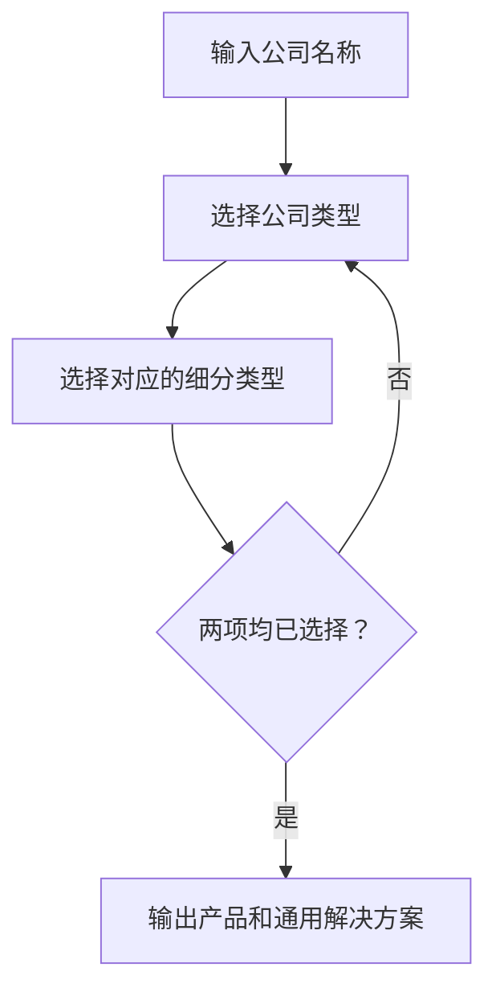

# 销售洞察客户类型确认与选项调整（需求草稿）

> 本文仅记录已确认的流程和选项调整。产品及通用解决方案的具体匹配规则、结果展示形式为 TBD，不在本文中新增业务规则。

# 第一部分：业务需求

## 01 目标与流程

销售输入公司名称后，选择公司类型及对应的细分类型。只有两项均选择完成，才能获得产品和通用解决方案的后续输出。

## 02 关键业务规则

| 规则 | 要求 |
| --- | --- |
| 前置条件 | 公司类型和对应细分类型均选择完成后，才能输出产品和通用解决方案；任一项未选择时，不输出上述结果。 |
| 物流服务型选项 | 从其细分类型中删除“个体司机”。 |
| 产业平台型选项 | 从其细分类型中删除“网货平台”。 |

# 第二部分：AI 与系统方案

## 03 系统处理边界

| 输入 | 系统处理 | 输出 |
| --- | --- | --- |
| 公司名称 | 展示公司类型及对应细分类型供销售选择 | 待选择的类型选项 |
| 已选择的公司类型及对应细分类型 | 检查两项是否均已选择 | 已完成选择时，按现有规则输出产品和通用解决方案；否则不输出 |

产品和通用解决方案的匹配规则、候选数据来源及展示形式：TBD（沿用现有实现的具体范围待确认）。

# 第三部分：人机协作与产出物管理

## 04 用户确认

| 确认点 | 用户操作 | 确认前 | 确认后 |
| --- | --- | --- | --- |
| 公司类型及对应细分类型 | 销售选择两项 | 不输出产品和通用解决方案 | 可以输出产品和通用解决方案 |

# 第四部分：异常处理与效果度量

## 05 未完成选择与验收

未完成公司类型或细分类型选择时，系统停留在选择步骤，不输出产品和通用解决方案。其他异常提示文案：TBD。

| 验收场景 | 预期结果 |
| --- | --- |
| 已输入公司名称，但未选择公司类型 | 不输出产品和通用解决方案。 |
| 已选择公司类型，但未选择对应细分类型 | 不输出产品和通用解决方案。 |
| 已选择公司类型及对应细分类型 | 可以输出产品和通用解决方案。 |
| 选择物流服务型 | 细分类型中不出现“个体司机”。 |
| 选择产业平台型 | 细分类型中不出现“网货平台”。 |
