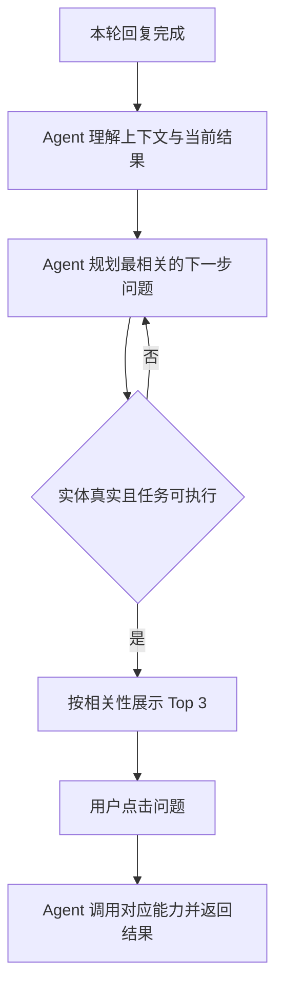

# 上下文动态 Follow up PRD 草稿

> 文档状态：V0.1 草稿  
> 需求依据：同目录《上下文动态Follow-up_需求分析草稿.md》  
> 未确认规则均以 TBD 标记，不作为正式开发结论。

## 00 使用说明

### 00.1 需求状态与变更记录

| 版本 | 日期 | 变更内容 | 变更人 |
| --- | --- | --- | --- |
| V0.1 | 2026-09-01 | 首次创建上下文动态 Follow up PRD 草稿 | Codex |

# 第一部分：业务需求

## 01 项目背景与目标

需求背景：当前消息级 Follow up 为固定文案，无法随上下文变化，存在相关性不足、公司名称虚构、缺少线索或车辆实体仍推荐相关任务，以及点击后无法获得结果的问题。

一句话目标：用户查看 AI 回复后，获得 3 条与当前上下文直接相关、实体真实且点击后可执行的 Follow up。

业务价值：减少无效点击、错误实体和二次澄清；质量基线待建立。

## 02 用户场景与交互流程

### 02.1 业务流程

流程描述：采用 Agent 推荐模式。Agent 自主完成上下文理解、下一步规划和规则校验，系统只向用户展示通过校验的问题；用户点击后，Agent 调用对应 Skill/Tool 并返回结果。

## 03 需求定义

### 03.1 关键业务规则

| 规则ID | 触发条件 | 规则内容 | 优先级/顺序 |
| --- | --- | --- | --- |
| BR-001 | 本轮 AI 回复完成 | 基于当前问题、有效会话上下文和本轮结果动态生成 Follow up，不读取固定问题作为最终输出 | 1 |
| BR-002 | 候选包含公司名称 | 公司名称必须逐字来源于有效上下文或当前用户有权限访问的业务数据；来源不明则过滤 | 2 |
| BR-003 | 候选属于线索任务 | 仅当存在完成该任务所需的明确公司或线索实体时保留 | 3 |
| BR-004 | 候选属于车辆任务 | 仅当存在完成该任务所需的明确车辆实体时保留 | 3 |
| BR-005 | 候选进入排序前 | 必须校验可路由 Skill/Tool、必要实体、可用数据源和明确输出形态 | 4 |
| BR-006 | 候选通过全部校验 | 按与当前任务、焦点实体、本轮结果的相关性降序排列，展示 Top 3 | 5 |
| BR-007 | 用户点击 Follow up | 沿用现有交互，问题直接发送并执行，不要求用户再次填写系统已确认的实体 | 6 |
| BR-008 | 查询结果确实为空 | 返回明确无结果及可继续操作，不编造公司、线索、车辆或业务数据 | 7 |
| BR-009 | 合格候选不足 3 条 | 处理策略为 TBD；不得以虚构实体或不可执行问题补足 | 强约束 |

### 03.2 强规则、匹配与排序

| 规则ID | 适用场景 | 候选数据 | 上下文信息 | 匹配与计算规则 | 排序与数量 |
| --- | --- | --- | --- | --- | --- |
| BR-MATCH-001 | 消息级 Follow up | AI 生成的候选问题 | 当前用户问题、有效历史上下文、本轮答案、焦点意图与实体 | 先执行公司名、线索实体、车辆实体、路由、数据、输出六项门控；全部通过后计算相关性，具体权重 TBD | 相关性降序；目标展示 3 条 |

并列规则、相关性权重、有效历史窗口及候选不足策略均为 TBD。模型不得绕过实体门控或可执行性校验。

### 03.3 AI 任务定义

| AI 任务 | 触发条件 | 输入 | 输出 | 判断正确的标准 |
| --- | --- | --- | --- | --- |
| 上下文理解 | 本轮回复完成 | 当前问题、有效历史、本轮结果 | 焦点意图、焦点实体、任务状态 | 不引入输入中不存在的实体 |
| 候选 Follow up 生成 | 上下文理解完成 | 焦点意图、实体、任务结果、可用能力清单 | 结构化候选问题及依赖实体 | 候选与当前结果直接相关且语义完整 |
| 相关性排序 | 候选通过规则校验 | 合格候选、当前任务焦点 | 排序后的候选列表 | 排序结果与配置规则一致 |

### 03.4 功能清单

| 模块 | 功能 | 输入 | 输出 | 优先级 |
| --- | --- | --- | --- | --- |
| 对话服务 | 上下文与实体提取 | 会话上下文、本轮结果 | 结构化意图与实体 | P0 |
| Follow up 服务 | 候选生成 | 结构化上下文、能力清单 | 候选问题列表 | P0 |
| Follow up 服务 | 实体与来源门控 | 候选、实体来源 | 通过/过滤及原因 | P0 |
| Follow up 服务 | 可执行性校验 | 候选、路由、Tool、数据状态 | 通过/过滤及原因 | P0 |
| Follow up 服务 | 排序与截断 | 合格候选、排序配置 | Top 3 | P0 |
| 对话前端 | 展示与点击发送 | Top 3 | Follow up 组件、用户消息 | P0 |
| 埋点 | 质量记录 | 曝光、点击、执行状态、过滤原因 | 分析事件 | P1 |

## 04 能力边界与意图路由

### 04.1 能力边界

| # | 允许范围 | 禁止 / 不负责 | 超出范围处理 |
| --- | --- | --- | --- |
| 1 | 根据当前会话和本轮结果推荐下一步问题 | 引入上下文及授权数据之外的公司名称 | 过滤候选 |
| 2 | 推荐已有 Skill/Tool 可执行的查询、生成、比较或解释任务 | 推荐没有路由、缺少必要实体或无输出能力的任务 | 过滤候选 |
| 3 | 在存在明确实体时推荐线索或车辆任务 | 无公司、线索或车辆实体时猜测主体 | 改选不依赖缺失实体的候选；不足策略 TBD |

### 04.2 意图与路由矩阵

| 意图 | 直接命中条件 | 必要实体/槽位 | 允许 Skill / Tool | 歧义处理 | 完成条件 |
| --- | --- | --- | --- | --- | --- |
| 线索查询/处理 | 候选明确指向线索任务 | 明确公司或线索实体；具体槽位按线索 Skill 定义 | 线索管家相关能力 | 实体不明确时候选不得展示 | 返回线索结果或明确无结果 |
| 车辆查询/详情/对比/方案 | 候选明确指向车辆任务 | 对应任务所需的明确车辆实体 | 车辆管家相关能力 | 实体不明确时候选不得展示 | 返回车辆信息、对比或方案结果；无数据时明确说明 |
| 当前答案延伸 | 可由本轮结果继续解释、归纳或展开 | 本轮结果中的明确对象 | 当前已命中能力 | 对象不明确时过滤 | 返回与本轮结果直接相关的内容 |

跨轮规则：仅使用有效上下文中的焦点实体；有效轮次范围、实体切换和失效规则为 TBD。

## 05 任务状态与用户反馈

| 状态 | 触发条件 | 用户看到什么 | 用户可以做什么 |
| --- | --- | --- | --- |
| 生成中 | 本轮主回复完成、候选尚未就绪 | 不展示旧的固定 Follow up | 等待 |
| 可用 | 通过校验并完成排序 | 3 条 Follow up | 点击任一问题 |
| 执行中 | 用户点击并直接发送 | 现有任务执行反馈 | 停止 |
| 已完成 | 对应任务执行完成 | 业务结果或明确无结果 | 继续追问 |

# 第二部分：AI 与系统方案

## 06 Agent / Skill / Tool 设计

### 06.1 本需求涉及的 Skill

| Skill 名称 | 负责的业务子任务 | 触发 / 调用条件 | 调用的 Tool | 能力边界 |
| --- | --- | --- | --- | --- |
| Follow up 生成 | 理解上下文、生成并排序候选 | 本轮回复完成 | 上下文读取、能力查询、规则校验 Tool | 不得自行认定实体来源有效或能力可执行 |
| 线索管家 | 执行通过校验的线索类问题 | 用户点击线索类 Follow up | 现有线索 Tool，具体名称 TBD | 无必要实体时不得调用 |
| 车辆管家 | 执行通过校验的车辆类问题 | 用户点击车辆类 Follow up | 现有车辆 Tool，具体名称 TBD | 无必要车辆实体时不得调用 |

### 06.2 本需求涉及的 Tool

| Tool 名称 | 业务用途 | 使用条件 | 数据来源 | 权限要求 |
| --- | --- | --- | --- | --- |
| 上下文读取 Tool（TBD） | 获取当前问题、有效历史、本轮结果和实体来源 | 每轮生成 Follow up 前 | 当前会话 | 当前会话用户 |
| 能力目录 Tool（TBD） | 查询候选意图是否存在可执行 Skill/Tool 和输出形态 | 候选生成后 | 系统能力配置 | 系统内部 |
| 实体校验 Tool（TBD） | 校验公司、线索、车辆实体及来源 | 候选含相关实体或意图 | 会话上下文、授权业务系统 | 按现有数据权限 |

## 07 数据来源

| 所需数据 | 数据来源 | 业务用途 | 来源优先级与权限 |
| --- | --- | --- | --- |
| 当前问题、本轮结果、历史焦点 | 当前会话 | 上下文理解、相关性排序 | 当前轮与本轮结果优先；历史窗口 TBD |
| 公司与线索实体 | 当前会话、用户有权限访问的线索/客户数据 | 名称来源校验、线索任务门控 | 业务系统为准；仅限有权限用户 |
| 车辆实体 | 当前会话、本轮车辆结果、车辆业务数据 | 车辆任务门控 | 车辆业务系统为准；跨轮范围 TBD |
| 能力与路由清单 | 系统能力配置 | 可执行性校验 | 已上线且可用的配置优先 |

## 08 Prompt 与 AI 能力要求

### 08.1 Prompt 业务要求

AI 角色：销售秘书对话中的下一步任务推荐助手。

业务目标：生成与当前上下文直接相关、实体有来源、点击后可执行的 Follow up。

适用范围：当前会话内消息级 Follow up；不替代首页专家固定推荐问题。

所需业务信息：当前问题、有效上下文、本轮结果、焦点实体、可用 Skill/Tool、数据可用状态。

结果要求：输出结构化候选，至少包含问题文案、意图、依赖实体、实体来源、目标 Skill/Tool、预期输出类型和相关性信息。

行为约束：不得创造公司、线索或车辆实体；不得输出未经规则校验的候选；不得承诺系统不具备的结果。

## 09 交互设计

### 09.1 页面 / 组件清单

| 页面/组件 | 入口 | 展示内容 | 用户动作 | 状态 | 原型链接 |
| --- | --- | --- | --- | --- | --- |
| 对话消息 Follow up | 每轮 AI 回复下方 | 最相关的 3 条问题 | 点击后直接发送 | 生成中/可用/执行中 | 沿用现有 PC 交互，链接 TBD |

# 第三部分：人机协作与产出物管理

## 11 用户确认与写操作

| 确认场景 | 触发条件 | 展示内容及默认值来源 | 用户操作 | 确认后处理 |
| --- | --- | --- | --- | --- |
| Follow up 点击 | 候选已通过校验 | 完整问题文案；实体来自当前上下文或授权数据 | 点击/不点击 | 点击后直接发送并执行 |
| 后续写操作确认 | Follow up 触发 CRM 等写操作 | 沿用对应 Skill 的写操作确认卡和字段来源 | 确认/编辑/取消 | 仅确认后写入 |

本需求不新增免确认写操作；Follow up 的可点击不等于授权写入业务系统。

# 第四部分：异常处理与效果度量

## 13 异常处理

| 场景 | 识别条件 | 系统策略 | 用户提示 |
| --- | --- | --- | --- |
| 公司名称来源不明 | 候选公司名无法回溯到有效上下文或授权数据 | 过滤候选并记录原因 | 不展示该候选 |
| 缺少线索必要实体 | 线索候选缺少明确公司或线索 | 过滤候选 | 不展示该候选 |
| 缺少车辆必要实体 | 车辆候选缺少明确车辆 | 过滤候选 | 不展示该候选 |
| 能力不可执行 | 无可用路由、Tool、数据或输出形态 | 过滤候选 | 不展示该候选 |
| 合格候选不足 3 条 | 全部门控后少于 3 条 | 不得虚构实体补足；展示策略 TBD | TBD |
| 点击后查询无结果 | 业务系统返回空结果 | 明确未找到，不编造 | 当前没有查询到符合条件的结果。 |
| 点击后系统不可用 | 调用失败或超时 | 保留用户输入并允许重试 | 当前任务处理未完成，请稍后重试。 |

## 14 埋点与指标

### 14.1 业务埋点

| 用户行为 / 事件 | 记录时机 | 业务分析维度 | 用途 |
| --- | --- | --- | --- |
| followup_generate | 候选生成完成 | 候选数、合格数、耗时 | 评估生成覆盖与时延 |
| followup_filter | 候选被过滤 | 过滤原因、意图类型、实体类型；不记录未脱敏敏感内容 | 定位公司名、实体和可执行性问题 |
| followup_expose | Follow up 展示 | question_id、position、intent、target_skill | 计算曝光与点击 |
| followup_click | 用户点击 | question_id、position、intent、target_skill | 计算 CTR |
| followup_execute_result | 点击任务结束 | success/no_result/fail、intent、target_skill | 计算可执行成功率与无结果率 |

现有 `followup_expose / followup_click` 事件应复用或扩展，不重复建立同义事件；最终字段方案 TBD。

## 15 验收标准与测试用例

### 15.1 验收标准

1. 每轮回复后的 Follow up 均由当前上下文动态生成，不直接展示写死文案。
2. 展示的公司名称均可追溯到当前有效上下文或用户有权限访问的业务数据。
3. 无公司及线索实体时，不展示依赖该实体的线索 Follow up；无车辆实体时，不展示依赖具体车辆的车辆 Follow up。
4. 每条展示问题均记录目标意图、必要实体、目标 Skill/Tool 和预期输出，并在点击后进入对应任务。
5. 业务查询为空时明确返回无结果，不生成虚构数据。
6. 候选不足 3 条时的验收口径待规则确认后补充。

### 15.2 MECE 测试用例

| 用例ID | 类型 | 前置条件/输入 | 预期结果 |
| --- | --- | --- | --- |
| TC-01 | 正向-普通上下文 | 本轮答案包含可继续解释的明确内容，不含公司或车辆 | 展示与本轮答案相关且不依赖公司、线索、车辆实体的合格 Follow up |
| TC-02 | 正向-公司有来源 | 用户明确输入公司 A，且公司 A 可被当前用户访问 | 可生成含公司 A 的相关问题；公司名与来源一致 |
| TC-03 | 正向-线索实体存在 | 上下文存在明确公司或线索，线索能力可用 | 可展示线索类 Follow up，点击后返回结果或明确无结果 |
| TC-04 | 正向-车辆实体存在 | 本轮车辆结果包含明确车型，车辆能力可用 | 可展示依赖该车型的详情、对比或方案问题，具体任务仍需满足对应槽位规则 |
| TC-05 | 反向-公司名无来源 | 模型候选包含上下文和授权数据中不存在的公司名 | 候选被过滤，不展示 |
| TC-06 | 反向-无线索实体 | 上下文没有公司和线索实体 | 所有依赖公司或线索的候选被过滤 |
| TC-07 | 反向-无车辆实体 | 上下文没有车辆实体 | 所有依赖具体车辆的候选被过滤 |
| TC-08 | 反向-能力不可用 | 候选语义相关，但目标 Skill/Tool 未上线或不可用 | 候选被过滤 |
| TC-09 | 反向-数据不可用 | 必要实体存在，但目标数据源当前不可访问 | 候选不作为“保证有业务结果”的问题展示；具体降级策略 TBD |
| TC-10 | 边界-同名公司 | 上下文存在多个同名主体且未确认唯一主体 | 不展示带具体主体执行的 Follow up，不猜测主体 |
| TC-11 | 边界-实体已切换 | 用户从公司 A 切换到公司 B | Follow up 只引用当前焦点公司 B；焦点切换规则待配置 |
| TC-12 | 边界-车辆多选 | 会话存在多辆车但用户未明确焦点 | 仅展示不要求猜测具体车辆的问题，或按车辆管家既有选择规则执行 |
| TC-13 | 边界-业务空结果 | 点击合格候选后业务系统返回 0 条 | 返回明确无结果，不编造数据，任务状态可追踪 |
| TC-14 | 边界-候选不足 | 规则过滤后仅剩 1–2 条合格候选 | 不以虚构实体或不可执行问题补足；最终展示行为按 TBD 规则验收 |
