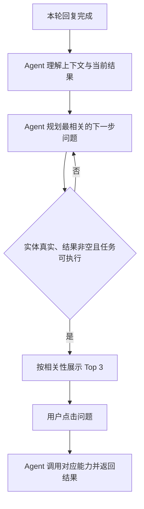

# 上下文动态 Follow up PRD 草稿

> 文档状态：V0.1 草稿  
> 需求依据：同目录《上下文动态Follow-up_需求分析草稿.md》  
> 未确认规则均以 TBD 标记，不作为正式开发结论。

## 00 使用说明

### 00.1 需求状态与变更记录

| 版本 | 日期 | 变更内容 | 变更人 |
| --- | --- | --- | --- |
| V0.1 | 2026-09-01 | 首次创建上下文动态 Follow up PRD 草稿 | Codex |
| V0.2 | 2026-09-01 | 确认候选补足、非空结果及车辆实体引用规则 | Codex |
| V0.3 | 2026-09-01 | 移除线索和车辆专项限制，统一为通用实体校验 | Codex |

# 第一部分：业务需求

## 01 项目背景与目标

需求背景：当前消息级 Follow up 为固定文案，无法随上下文变化，存在相关性不足、业务实体虚构、缺少必要信息仍推荐任务，以及点击后无法获得结果的问题。

一句话目标：用户查看 AI 回复后，获得 3 条与当前上下文直接相关、实体真实且点击后可执行的 Follow up。

业务价值：减少无效点击、错误实体和二次澄清；质量基线待建立。

## 02 用户场景与交互流程

### 02.1 业务流程

流程描述：采用 Agent 推荐模式。Agent 自主完成上下文理解、下一步规划和规则校验，系统只向用户展示通过校验的问题；用户点击后，Agent 调用对应 Skill/Tool 并返回结果。

## 03 需求定义

### 03.1 关键业务规则

| 规则ID | 触发条件 | 规则内容 | 优先级/顺序 |
| --- | --- | --- | --- |
| BR-001 | 本轮 AI 回复完成 | 基于当前问题、有效会话上下文和本轮结果动态生成 Follow up，不读取固定问题作为最终输出 | 1 |
| BR-002 | 候选包含业务实体 | 公司、客户、产品及其他业务实体必须来源于有效上下文、本轮结果或当前用户有权限访问的业务数据；来源不明则过滤 | 2 |
| BR-003 | 候选进入排序前 | 必须校验上下文相关性、实体来源、可路由 Skill/Tool、必要信息、可用数据、明确输出形态和非空结果 | 3 |
| BR-004 | 候选预计没有结果 | 过滤该候选，不作为 Follow up 展示 | 3 |
| BR-005 | 候选通过全部校验 | 按与当前任务、焦点实体和本轮结果的相关性降序排列 | 4 |
| BR-006 | 合格候选不足 3 条 | 使用不依赖缺失实体、且可从当前结果直接回答的通用问题补足至 3 条 | 5 |
| BR-007 | 用户点击 Follow up | 沿用现有交互，问题直接发送并执行，不要求用户再次填写系统已确认的信息 | 6 |

### 03.2 强规则、匹配与排序

| 规则ID | 适用场景 | 候选数据 | 上下文信息 | 匹配与计算规则 | 排序与数量 |
| --- | --- | --- | --- | --- | --- |
| BR-MATCH-001 | 消息级 Follow up | AI 生成的候选问题 | 当前用户问题、有效历史上下文、本轮答案、焦点意图与实体 | 校验上下文相关性、实体来源、必要信息、路由、数据、输出和非空结果；全部通过后计算相关性，具体权重 TBD | 相关性降序；不足时用当前结果可直接回答的通用问题补足至 3 条 |

并列规则、相关性权重及有效历史窗口为 TBD。模型不得绕过实体门控、非空结果门控或可执行性校验。

### 03.3 AI 任务定义

| AI 任务 | 触发条件 | 输入 | 输出 | 判断正确的标准 |
| --- | --- | --- | --- | --- |
| 上下文理解 | 本轮回复完成 | 当前问题、有效历史、本轮结果 | 焦点意图、焦点实体、任务状态 | 不引入输入中不存在的实体 |
| 候选 Follow up 生成 | 上下文理解完成 | 焦点意图、实体、任务结果、可用能力清单 | 结构化候选问题及依赖实体 | 候选与当前结果直接相关且语义完整 |
| 相关性排序 | 候选通过规则校验 | 合格候选、当前任务焦点 | 排序后的候选列表 | 排序结果与配置规则一致 |

### 03.4 功能清单

| 模块 | 功能 | 输入 | 输出 | 优先级 |
| --- | --- | --- | --- | --- |
| 对话服务 | 上下文与实体提取 | 会话上下文、本轮结果 | 结构化意图与实体 | P0 |
| Follow up 服务 | 候选生成 | 结构化上下文、能力清单 | 候选问题列表 | P0 |
| Follow up 服务 | 实体与来源门控 | 候选、实体来源 | 通过/过滤及原因 | P0 |
| Follow up 服务 | 可执行性校验 | 候选、路由、Tool、数据状态 | 通过/过滤及原因 | P0 |
| Follow up 服务 | 排序与截断 | 合格候选、排序配置 | Top 3 | P0 |
| 对话前端 | 展示与点击发送 | Top 3 | Follow up 组件、用户消息 | P0 |
| 埋点 | 质量记录 | 曝光、点击、执行状态、过滤原因 | 分析事件 | P1 |

## 04 能力边界与意图路由

### 04.1 能力边界

| # | 允许范围 | 禁止 / 不负责 | 超出范围处理 |
| --- | --- | --- | --- |
| 1 | 根据当前会话和本轮结果推荐下一步问题 | 引入有效上下文、本轮结果及授权数据之外的业务实体 | 过滤候选 |
| 2 | 推荐已有 Skill/Tool 可执行的查询、生成、比较或解释任务 | 推荐没有路由、缺少必要实体或无输出能力的任务 | 过滤候选 |
| 3 | 推荐点击后能够返回非空结果的任务 | 将预计无结果的问题作为 Follow up 展示 | 过滤候选并重新规划 |

### 04.2 意图与路由矩阵

| 意图 | 直接命中条件 | 必要实体/槽位 | 允许 Skill / Tool | 歧义处理 | 完成条件 |
| --- | --- | --- | --- | --- | --- |
| 业务任务延伸 | 候选指向已有业务能力 | 对应 Skill 要求的必要实体和参数 | 已上线且当前可用的 Skill/Tool | 实体、参数不明确或预计无结果时候选不得展示 | 返回非空业务结果 |
| 当前答案延伸 | 可由本轮结果继续解释、归纳或展开 | 本轮结果中的明确对象 | 当前已命中能力 | 对象不明确时过滤 | 返回与本轮结果直接相关的内容 |

跨轮规则：仅使用有效上下文中的焦点实体；有效轮次范围、实体切换和失效规则为 TBD。

## 05 任务状态与用户反馈

| 状态 | 触发条件 | 用户看到什么 | 用户可以做什么 |
| --- | --- | --- | --- |
| 生成中 | 本轮主回复完成、候选尚未就绪 | 不展示旧的固定 Follow up | 等待 |
| 可用 | 通过校验并完成排序 | 3 条 Follow up | 点击任一问题 |
| 执行中 | 用户点击并直接发送 | 现有任务执行反馈 | 停止 |
| 已完成 | 对应任务执行完成 | 非空业务结果 | 继续追问 |

# 第二部分：AI 与系统方案

## 06 Agent / Skill / Tool 设计

### 06.1 本需求涉及的 Skill

| Skill 名称 | 负责的业务子任务 | 触发 / 调用条件 | 调用的 Tool | 能力边界 |
| --- | --- | --- | --- | --- |
| Follow up 生成 | 理解上下文、生成并排序候选 | 本轮回复完成 | 上下文读取、能力查询、规则校验 Tool | 不得自行认定实体来源有效或能力可执行 |
| 已有业务 Skill | 执行通过校验的业务问题 | 用户点击对应 Follow up | 对应业务 Tool | 无必要信息、不可执行或预计无结果时不得调用 |

### 06.2 本需求涉及的 Tool

| Tool 名称 | 业务用途 | 使用条件 | 数据来源 | 权限要求 |
| --- | --- | --- | --- | --- |
| 上下文读取 Tool（TBD） | 获取当前问题、有效历史、本轮结果和实体来源 | 每轮生成 Follow up 前 | 当前会话 | 当前会话用户 |
| 能力目录 Tool（TBD） | 查询候选意图是否存在可执行 Skill/Tool 和输出形态 | 候选生成后 | 系统能力配置 | 系统内部 |
| 实体校验 Tool（TBD） | 校验候选所含业务实体及其来源 | 候选含业务实体 | 当前会话、本轮结果、授权业务系统 | 按现有数据权限 |

## 07 数据来源

| 所需数据 | 数据来源 | 业务用途 | 来源优先级与权限 |
| --- | --- | --- | --- |
| 当前问题、本轮结果、历史焦点 | 当前会话 | 上下文理解、相关性排序 | 当前轮与本轮结果优先；历史窗口 TBD |
| 业务实体 | 当前会话、本轮结果、用户有权限访问的业务数据 | 实体来源及必要信息校验 | 业务系统为准；仅限有权限用户 |
| 能力与路由清单 | 系统能力配置 | 可执行性校验 | 已上线且可用的配置优先 |

## 08 Prompt 与 AI 能力要求

### 08.1 Prompt 业务要求

AI 角色：销售秘书对话中的下一步任务推荐助手。

业务目标：生成与当前上下文直接相关、实体有来源、点击后可执行的 Follow up。

适用范围：当前会话内消息级 Follow up；不替代首页专家固定推荐问题。

所需业务信息：当前问题、有效上下文、本轮结果、焦点实体、可用 Skill/Tool、数据可用状态。

结果要求：输出结构化候选，至少包含问题文案、意图、依赖实体、实体来源、目标 Skill/Tool、预期输出类型和相关性信息。

行为约束：不得创造公司、客户、产品及其他业务实体；不得输出未经规则校验或预计无结果的候选；不得承诺系统不具备的结果。

## 09 交互设计

### 09.1 页面 / 组件清单

| 页面/组件 | 入口 | 展示内容 | 用户动作 | 状态 | 原型链接 |
| --- | --- | --- | --- | --- | --- |
| 对话消息 Follow up | 每轮 AI 回复下方 | 最相关的 3 条问题 | 点击后直接发送 | 生成中/可用/执行中 | 沿用现有 PC 交互，链接 TBD |

# 第三部分：人机协作与产出物管理

## 11 用户确认与写操作

| 确认场景 | 触发条件 | 展示内容及默认值来源 | 用户操作 | 确认后处理 |
| --- | --- | --- | --- | --- |
| Follow up 点击 | 候选已通过校验 | 完整问题文案；实体来自当前上下文或授权数据 | 点击/不点击 | 点击后直接发送并执行 |
| 后续写操作确认 | Follow up 触发 CRM 等写操作 | 沿用对应 Skill 的写操作确认卡和字段来源 | 确认/编辑/取消 | 仅确认后写入 |

本需求不新增免确认写操作；Follow up 的可点击不等于授权写入业务系统。

# 第四部分：异常处理与效果度量

## 13 异常处理

| 场景 | 识别条件 | 系统策略 | 用户提示 |
| --- | --- | --- | --- |
| 业务实体来源不明 | 候选实体无法回溯到有效上下文、本轮结果或授权数据 | 过滤候选并记录原因 | 不展示该候选 |
| 缺少必要信息 | 候选缺少目标 Skill 要求的实体或参数 | 过滤候选，改用不依赖缺失信息的问题 | 不展示原候选 |
| 能力不可执行 | 无可用路由、Tool、数据或输出形态 | 过滤候选 | 不展示该候选 |
| 合格候选不足 3 条 | 全部门控后少于 3 条 | 使用不依赖缺失实体、且可从当前结果直接回答的通用问题补足 | 补足后统一展示 3 条 |
| 候选预计无结果 | 预校验未找到可返回内容 | 过滤该候选并重新规划 | 不展示该候选 |
| 点击后意外无结果 | 展示后数据变化导致执行时返回空结果 | 明确未找到并记录异常，不编造 | 当前没有查询到符合条件的结果。 |
| 点击后系统不可用 | 调用失败或超时 | 保留用户输入并允许重试 | 当前任务处理未完成，请稍后重试。 |

## 14 埋点与指标

### 14.1 业务埋点

| 用户行为 / 事件 | 记录时机 | 业务分析维度 | 用途 |
| --- | --- | --- | --- |
| followup_generate | 候选生成完成 | 候选数、合格数、耗时 | 评估生成覆盖与时延 |
| followup_filter | 候选被过滤 | 过滤原因、意图类型、实体类型；不记录未脱敏敏感内容 | 定位实体来源和可执行性问题 |
| followup_expose | Follow up 展示 | question_id、position、intent、target_skill | 计算曝光与点击 |
| followup_click | 用户点击 | question_id、position、intent、target_skill | 计算 CTR |
| followup_execute_result | 点击任务结束 | success/no_result/fail、intent、target_skill | 计算可执行成功率与无结果率 |

现有 `followup_expose / followup_click` 事件应复用或扩展，不重复建立同义事件；最终字段方案 TBD。

## 15 验收标准与测试用例

### 15.1 验收标准

1. 每轮回复后的 Follow up 均由当前上下文动态生成，不直接展示写死文案。
2. 展示的业务实体均可追溯到有效上下文、本轮结果或用户有权限访问的业务数据。
3. 缺少目标任务必要实体或参数时，不展示依赖该信息的 Follow up。
4. 每条展示问题均记录目标意图、必要实体、目标 Skill/Tool 和预期输出，并在点击后进入对应任务。
5. 预计没有结果的候选不得展示为 Follow up。
6. 合格候选不足 3 条时，使用不依赖缺失实体、且可从当前结果直接回答的通用问题补足至 3 条。

### 15.2 MECE 测试用例

| 用例ID | 类型 | 前置条件/输入 | 预期结果 |
| --- | --- | --- | --- |
| TC-01 | 正向-当前答案延伸 | 本轮结果包含可继续解释或展开的明确内容 | 展示与本轮结果直接相关的 Follow up |
| TC-02 | 正向-业务实体有来源 | 候选实体来自有效上下文、本轮结果或授权业务数据 | 候选通过实体来源校验 |
| TC-03 | 正向-业务任务可执行 | 目标 Skill/Tool 可用、必要信息完整且预校验存在结果 | 展示候选，点击后返回非空结果 |
| TC-04 | 反向-实体无来源 | 候选包含有效上下文、本轮结果和授权数据中不存在的实体 | 候选被过滤，不展示 |
| TC-05 | 反向-必要信息缺失 | 候选缺少目标 Skill 要求的实体或参数 | 候选被过滤，改用不依赖缺失信息的问题 |
| TC-06 | 反向-能力不可用 | 候选语义相关，但目标 Skill/Tool 未上线或不可用 | 候选被过滤 |
| TC-07 | 反向-预计无结果 | 实体和能力均有效，但预校验无可返回内容 | 候选被过滤，并使用其他合格问题或通用问题补足 |
| TC-08 | 反向-数据不可用 | 必要信息存在，但目标数据源当前不可访问 | 候选被过滤，不展示 |
| TC-09 | 边界-同名实体 | 上下文存在多个同名实体且未确认唯一对象 | 不展示依赖具体对象执行的 Follow up，不猜测对象 |
| TC-10 | 边界-焦点实体切换 | 用户从实体 A 切换到实体 B | Follow up 仅引用当前焦点实体 B；焦点切换规则待配置 |
| TC-11 | 边界-执行时意外无结果 | 候选展示后数据变化，点击时返回 0 条 | 明确返回无结果并记录异常，不编造数据 |
| TC-12 | 边界-候选不足 | 规则过滤后仅剩 1–2 条合格候选 | 使用不依赖缺失实体、且可从当前结果直接回答的通用问题补足至 3 条 |
