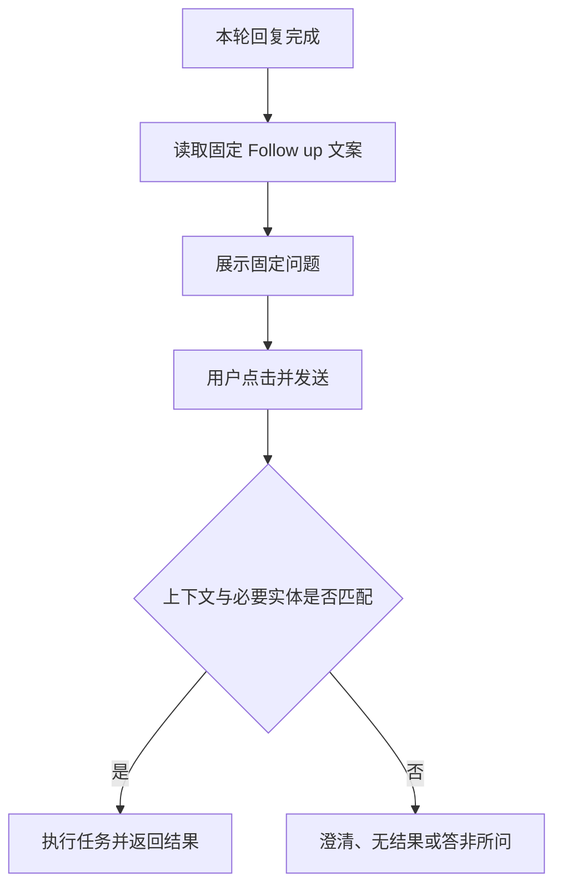
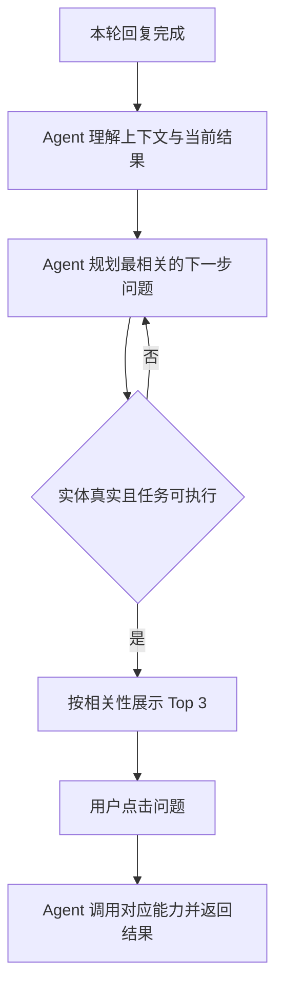

# 上下文动态 Follow up 需求分析草稿

> 状态：草稿。依据用户口头需求及现有《PC端交互》《线索管家》《车辆管家》整理；未确认内容统一标记为 TBD。

## 一、需求背景分析

当前系统的 Follow up 为固定文案，不能随当前用户问题、会话上下文和本轮结果变化，容易出现相关性不足、虚构公司名称，或在上下文不存在公司、线索、车辆时推荐无法执行的问题。现有机制存在点击后得不到实际结果的情况，降低推荐问题的可用性。

受影响范围：AI 销售秘书统一对话流中的消息级 Follow up；首页专家推荐问题不在本次范围内。

## 二、需求目标确认

1. 每轮回复完成后，基于当前用户问题、有效会话上下文和本轮结果生成最相关的 Follow up。
2. 沿用现有 PC 端交互，每次展示 3 条，点击后直接发送。
3. 公司名称只能引用上下文或授权业务数据中已存在且主体明确的名称，不得生成新公司名称。
4. 线索类 Follow up 仅在上下文存在可用公司或线索实体时生成；车辆类 Follow up 仅在上下文存在可用车辆实体时生成。
5. 每条 Follow up 在展示前通过“可执行性校验”，确保系统具备明确路由、所需实体和可用数据，可返回业务结果或明确的无结果说明。

> “给出结果”在本草稿中定义为：点击后可完成查询、生成、比较、解释等任务并返回内容；业务数据确实为空时，返回明确的无结果说明，不编造数据。该口径待确认。

## 三、业务流程分析

### 3.1 当前流程（现状）

### 3.2 目标流程（改善后）

流程说明：Agent 按“理解—规划—校验—执行”闭环工作。校验节点统一检查公司名称来源、线索或车辆必要实体，以及任务路由和结果能力；未通过的候选由 Agent 重新规划，不向用户展示。

## 四、功能拆解清单

| 终端/模块 | 功能 | 功能描述 | 优先级 |
| --- | --- | --- | --- |
| AI 销售秘书 / 对话 | 上下文提取 | 提取当前问题、有效历史上下文、本轮结果、焦点公司、线索和车辆实体 | Must |
| AI 销售秘书 / 对话 | 候选问题生成 | 生成与当前上下文直接相关、点击后可执行的候选 Follow up | Must |
| AI 销售秘书 / 对话 | 公司名称来源校验 | 公司名称仅允许引用有效上下文或授权业务数据中的明确实体 | Must |
| AI 销售秘书 / 对话 | 线索实体门控 | 无可用公司或线索实体时，过滤依赖公司或线索的 Follow up | Must |
| AI 销售秘书 / 对话 | 车辆实体门控 | 无可用车辆实体时，过滤依赖具体车辆的 Follow up | Must |
| AI 销售秘书 / 对话 | 可执行性校验 | 校验意图路由、必要实体、数据来源和输出形态，失败候选不展示 | Must |
| AI 销售秘书 / 对话 | 相关性排序 | 对合格候选排序并展示 Top 3 | Must |
| AI 销售秘书 / 对话 | 点击执行 | 沿用现有交互，点击 Follow up 后直接发送并进入对应任务 | Must |
| 数据埋点 | 质量反馈 | 记录曝光、点击、执行结果及过滤原因 | Should |

## 五、待确认事项

| 序号 | 待确认事项 | 状态 | 负责人 | 截止日期 |
| --- | --- | --- | --- | --- |
| 1 | 合格候选不足 3 条时，是少于 3 条展示，还是使用不依赖缺失实体、且可从当前结果直接回答的通用问题补足 | 待确认 | 产品 | TBD |
| 2 | “给出结果”是否接受“明确无结果”作为有效结果 | 待确认 | 产品 | TBD |
| 3 | 公司名称允许引用的“有效上下文”轮次范围及失效规则 | 待确认 | 产品/研发 | TBD |
| 4 | 车辆实体是否仅限本轮结果，还是可引用当前会话内已展示或已选入对比池的车辆 | 待确认 | 产品 | TBD |
| 5 | 每轮生成时延、相关性评测目标值和可执行成功率目标值 | 待确认 | 产品/算法 | TBD |
