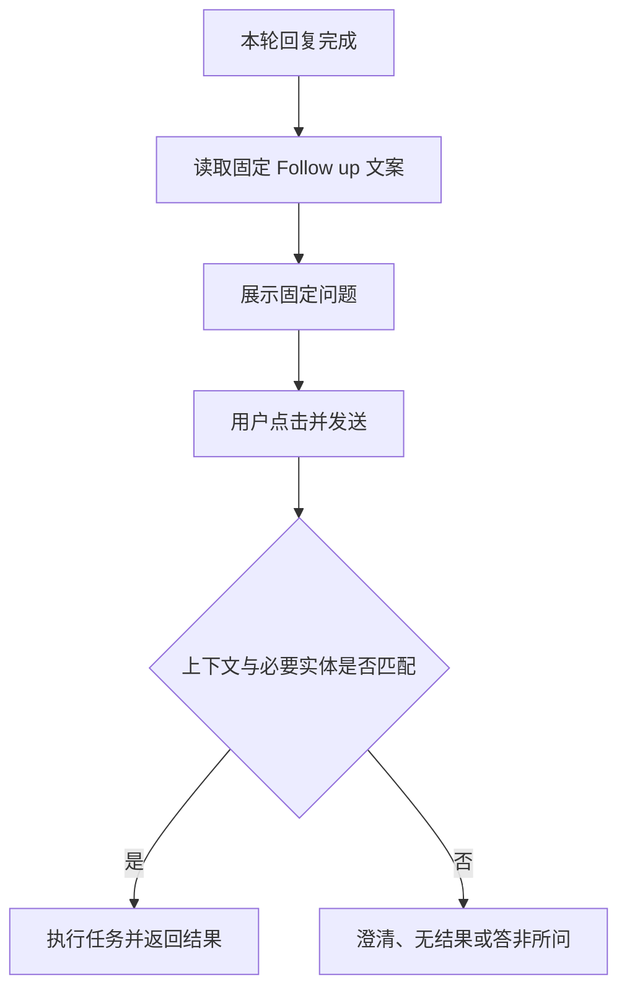
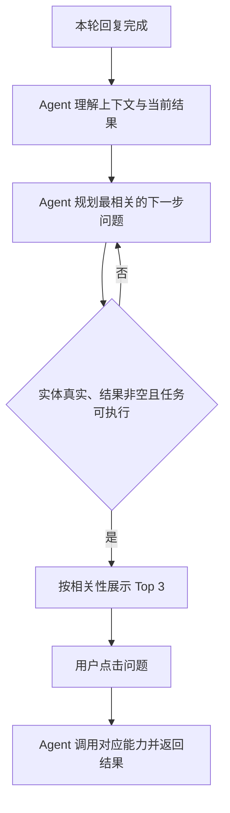

# 上下文动态 Follow up 需求分析草稿

> 状态：草稿。依据用户口头需求及现有《PC端交互》整理；未确认内容统一标记为 TBD。

## 一、需求背景分析

当前系统的 Follow up 为固定文案，不能随当前用户问题、会话上下文和本轮结果变化，存在相关性不足、编造业务实体、缺少必要信息仍推荐任务，以及点击后得不到实际结果的问题。

受影响范围：AI 销售秘书统一对话流中的消息级 Follow up；首页专家推荐问题不在本次范围内。

## 二、需求目标确认

1. 每轮回复完成后，基于当前用户问题、有效会话上下文和本轮结果生成最相关的 Follow up。
2. 沿用现有 PC 端交互，每次展示 3 条，点击后直接发送。
3. Follow up 中的公司、客户、产品及其他业务实体只能引用有效上下文、本轮结果或用户有权限访问的业务数据，不得由模型编造。
4. 每条 Follow up 在展示前通过通用校验，确保实体来源可靠，并具备明确路由、必要信息、可用数据和非空结果；没有结果的候选不得展示。
5. 合格候选不足 3 条时，使用不依赖缺失实体、且可从当前结果直接回答的通用问题补足至 3 条。

> “给出结果”定义为：点击后可完成查询、生成、比较、解释等任务并返回非空内容；预计只能返回“无结果”的问题不得作为 Follow up。

## 三、业务流程分析

### 3.1 当前流程（现状）

### 3.2 目标流程（改善后）

流程说明：Agent 按“理解—规划—校验—执行”闭环工作。校验节点统一检查上下文相关性、业务实体来源、必要信息、任务路由及非空结果；未通过的候选由 Agent 重新规划，不向用户展示。

## 四、功能拆解清单

| 终端/模块 | 功能 | 功能描述 | 优先级 |
| --- | --- | --- | --- |
| AI 销售秘书 / 对话 | 上下文提取 | 提取当前问题、有效历史上下文、本轮结果、焦点意图和业务实体 | Must |
| AI 销售秘书 / 对话 | 候选问题生成 | 生成与当前上下文直接相关、点击后可执行的候选 Follow up | Must |
| AI 销售秘书 / 对话 | 实体来源校验 | 公司、客户、产品及其他业务实体仅允许引用有效上下文、本轮结果或授权业务数据 | Must |
| AI 销售秘书 / 对话 | 可执行性校验 | 校验意图路由、必要实体、数据来源、输出形态和非空结果，失败候选不展示 | Must |
| AI 销售秘书 / 对话 | 排序与补足 | 对合格候选排序；不足 3 条时，用不依赖缺失实体且可从当前结果直接回答的通用问题补足 | Must |
| AI 销售秘书 / 对话 | 点击执行 | 沿用现有交互，点击 Follow up 后直接发送并进入对应任务 | Must |
| 数据埋点 | 质量反馈 | 记录曝光、点击、执行结果及过滤原因 | Should |

## 五、待确认事项

| 序号 | 待确认事项 | 状态 | 负责人 | 截止日期 |
| --- | --- | --- | --- | --- |
| 1 | 业务实体允许引用的“有效上下文”轮次范围及失效规则 | 待确认 | 产品/研发 | TBD |
| 2 | 每轮生成时延、相关性评测目标值和可执行成功率目标值 | 待确认 | 产品/算法 | TBD |
